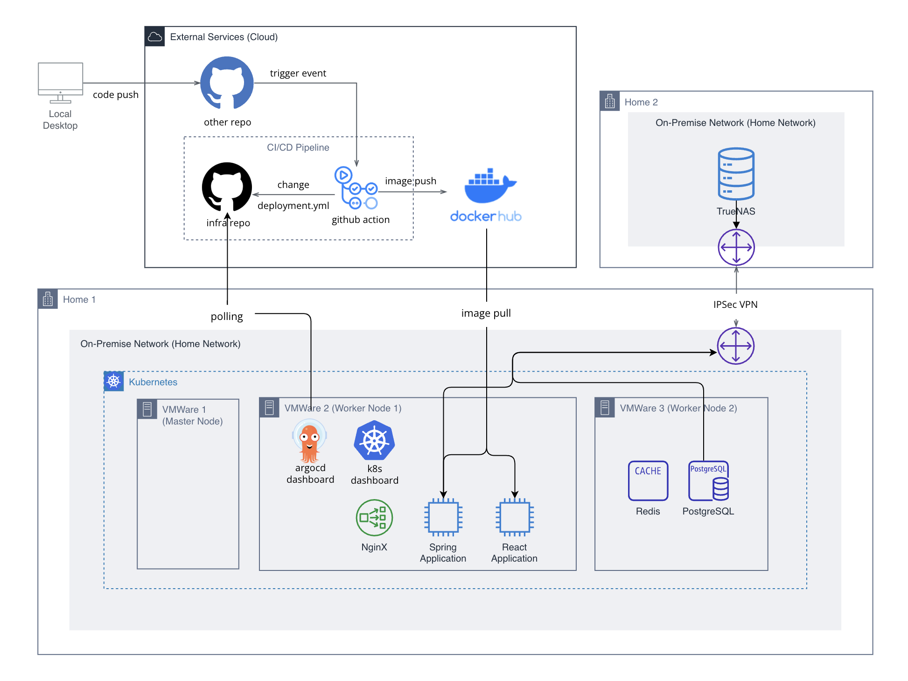

# 🚀 **Linkey-infra**  

<br>

## 📌 **목차**  

1. 🛠 **[환경 구성](#환경-구성)**  
2. 🏗 **[Kubernetes 설치](#Kubernetes-설치-및-설정)**  
3. 💡 **[Dashboard 설치](#Dashboard-설치)**  
4. ⚡ **[ArgoCD 사용](#argocd-사용)**  
5. 🔄 **[GithubAction 사용](#githubaction-사용)**  

---

## 🏛 **아키텍처**  



# 🛠 **환경 구성**  

## 1️⃣ **환경 개요**  

### 🖥 **운영체제 및 가상 환경**  
- **OS**: Ubuntu 24.04.2 LTS  
- **가상화 플랫폼**: VMWare Workstation  
- **SSH 클라이언트**: Termius, MobaXterm  

---

## 2️⃣ **VM 설정**  
| VM  | CPU | Disk  | Memory | Private IP       | 역할         |
|-----|-----|-------|--------|-----------------|--------------|
| VM1 | 2   | 20GB  | 2GB    | 192.168.219.101 | Master Node  |
| VM2 | 3   | 80GB  | 4GB    | 192.168.219.102 | Worker Node  |
| VM3 | 2   | 120GB | 3GB    | 192.168.219.103 | Worker Node  |

## 3️⃣ 외부네트워크 연결

##  Kubernetes 설치 및 설정


💡 **마스터 노드 1개 + 워커 노드 2개 구성**  


### 🔷 **공통 설정 (모든 노드 실행)**  
💡 기본 시스템 업데이트 및 Swap 비활성화
```bash
# 시스템 패키지 업데이트 및 업그레이드
$sudo apt update && sudo apt upgrade -y

# Swap 비활성화 (재부팅 후에도 유지)
$sudo swapoff -a
$sudo sed -i '/ swap / s/^\(.*\)$/#\1/g' /etc/fstab
```
💡 커널 모듈 및 네트워크 설정 적용
```bash
# 커널 모듈 및 네트워크 설정
$cat <<EOF | sudo tee /etc/modules-load.d/containerd.conf
overlay
br_netfilter
EOF

$sudo modprobe overlay
$sudo modprobe br_netfilter

$cat <<EOF | sudo tee /etc/sysctl.d/kubernetes.conf
net.bridge.bridge-nf-call-ip6tables = 1
net.bridge.bridge-nf-call-iptables = 1
net.ipv4.ip_forward = 1
EOF

$sudo sysctl --system
```

### 🔹 **Containerd 런타임 설치**  
💡 Docker 저장소 추가 및 Containerd 설치
```bash
$sudo apt install -y curl gnupg2 software-properties-common apt-transport-https ca-certificates

# Docker GPG Key 등록 및 Repo 추가
$curl -fsSL https://download.docker.com/linux/ubuntu/gpg | sudo gpg --dearmor -o /etc/apt/trusted.gpg.d/docker.gpg
$sudo add-apt-repository "deb [arch=amd64] https://download.docker.com/linux/ubuntu $(lsb_release -cs) stable"
```
💡 Containerd 설치 및 구성
```bash
$sudo apt update
$sudo apt install -y containerd.io

# Containerd 기본 설정 적용
$containerd config default | sudo tee /etc/containerd/config.toml >/dev/null 2>&1
$sudo sed -i 's/SystemdCgroup = false/SystemdCgroup = true/g' /etc/containerd/config.toml

# 서비스 재시작 및 활성화
$sudo systemctl restart containerd
$sudo systemctl enable containerd
```

### 🔹 **Kubernetes 패키지 설치**  
💡 K8s 저장소 추가 및 패키지 설치
```bash
# K8s APT Repository 추가
$sudo mkdir -p /etc/apt/keyrings
$curl -fsSL https://pkgs.k8s.io/core:/stable:/v1.30/deb/Release.key | sudo gpg --dearmor -o /etc/apt/keyrings/kubernetes-apt-keyring.gpg
echo "deb [signed-by=/etc/apt/keyrings/kubernetes-apt-keyring.gpg] https://pkgs.k8s.io/core:/stable:/v1.30/deb/ /" | sudo tee /etc/apt/sources.list.d/kubernetes.list

# Kubernetes 패키지 설치 및 버전 고정
$sudo apt update
$sudo apt install -y kubelet kubeadm kubectl
$sudo apt-mark hold kubelet kubeadm kubectl
```


---

## 🔷 **마스터 노드 설정**  
💡 Kubernetes 클러스터 초기화
```bash
# Kubeadm 초기화 (마스터 노드)
$sudo kubeadm init
```
💡 Kubernetes 설정 적용
```bash
# 현재 사용자에게 Kubeconfig 적용
$mkdir -p $HOME/.kube
$sudo cp -i /etc/kubernetes/admin.conf $HOME/.kube/config
$sudo chown $(id -u):$(id -g) $HOME/.kube/config

# 노드 상태 확인
$kubectl get nodes
```
💡 CNI 플러그인 설치 (NotReady 상태 해결)
```bash
# Calico 네트워크 플러그인 적용
$kubectl apply -f https://docs.projectcalico.org/manifests/calico.yaml

# Kubelet 재시작
$sudo systemctl restart kubelet
```

---

## 🔷 **워커 노드 설정**  
```bash
# 워커 노드 클러스터 합류 (토큰 값 필요)
$sudo kubeadm join 192.168.219.101:6443 --token <TOKEN> --discovery-token-ca-cert-hash sha256:<HASH>
```
> 💡 마스터 노드에서 `kubeadm token create --print-join-command` 명령어로 토큰 확인 가능  

---

## 📌 **확인 및 마무리**  
💡 클러스터 노드 상태 확인
```bash
$kubectl get nodes
```
- **정상 상태 예시**  
```
NAME    STATUS   ROLES           AGE   VERSION
vm1     Ready    control-plane   10m   v1.30.0
vm2     Ready    <none>          8m    v1.30.0
vm3     Ready    <none>          8m    v1.30.0
```

<br>
<br>


## 🖥️ **Dashboard 설치** (마스터 노드)

💡 **Kubernetes 대시보드는 클러스터의 리소스를 시각적으로 모니터링하고 관리할 수 있는 웹 UI**  

<br>


## 1️⃣ **대시보드 설치**  
```bash
kubectl apply -f https://raw.githubusercontent.com/kubernetes/dashboard/v2.7.0/aio/deploy/recommended.yaml
```
📌 실행하면 `kubernetes-dashboard` 네임스페이스에 관련 리소스 자동 생성  

---

## 2️⃣ **NodePort 방식으로 대시보드 서비스 수정**  

```bash
kubectl edit svc kubernetes-dashboard -n kubernetes-dashboard
```

🔧 **수정할 내용**  
```yaml
spec:
  type: NodePort  # 기존 'ClusterIP' -> 'NodePort' 변경
  ports:
  - nodePort: 31000  # NodePort 값 추가
    port: 443
    protocol: TCP
    targetPort: 8443
```
✅ **저장 후 종료 (`:wq`)**  

```bash
kubectl get svc -n kubernetes-dashboard
```

---

## 3️⃣ **대시보드 접속 테스트**  
```bash
$kubectl proxy
```
> 이후 브라우저에서 다음 URL로 접속 확인
```
https://<마스터 노드의 IP>:31000/#/login
```
예시:  
```
https://192.168.219.101:31000/#/login
```

---

## 4️⃣ **관리자 권한 계정 생성**  
### **1) Admin 사용자 서비스 계정 생성**  
```bash
$cat <<EOF | kubectl create -f -
apiVersion: v1
kind: ServiceAccount
metadata:
  name: admin-user
  namespace: kubernetes-dashboard
EOF
```

### **2) 생성된 서비스 계정 확인**  
```bash
$kubectl get serviceaccounts -n kubernetes-dashboard
```

---

## 5️⃣ **ClusterRoleBinding 생성 (권한 부여)**  
```bash
$cat <<EOF | kubectl create -f -
apiVersion: rbac.authorization.k8s.io/v1
kind: ClusterRoleBinding
metadata:
  name: admin-user
roleRef:
  apiGroup: rbac.authorization.k8s.io
  kind: ClusterRole
  name: cluster-admin
subjects:
  - kind: ServiceAccount
    name: admin-user
    namespace: kubernetes-dashboard
EOF
```

### **6) ClusterRoleBinding 설정 확인**  
```bash
$kubectl get clusterrolebinding admin-user
```

---

## 6️⃣ **대시보드 로그인 토큰 생성**  
```bash
$kubectl -n kubernetes-dashboard create token admin-user
```
> ✅ **출력된 토큰을 복사**하여 대시보드 로그인 화면에서 **"토큰(Token)" 로그인 방식**을 선택한 후 입력

---

## 🔶 **최종 확인**  
### **대시보드 URL**  
```
https://<마스터 노드의 IP>:31000/#/login
```
### **로그인 방법**  
1. `kubectl -n kubernetes-dashboard create token admin-user` 실행  
2. 출력된 토큰을 복사  
3. 브라우저에서 대시보드 접속 후, **"토큰(Token)" 로그인 방식** 선택  
4. 토큰 입력 후 로그인  

---


## ArgoCD 사용
📌 **디렉토리 구조**  
```
├── nginx
│   ├── configmap.yaml
│   ├── clusterrole.yaml
│   ├── clusterrolebinding.yaml
│   ├── deployment.yaml
│   ├── external-services.yaml
│   ├── ingress.yaml
│   ├── ingressclass.yaml
│   ├── service.yaml
│   └── serviceaccount.yaml
├── postgresql
│   ├── configmap.yaml
│   ├── pv.yaml
│   ├── pvc.yaml
│   ├── sealed-secret.yaml
│   ├── service.yaml
│   └── statefulset.yaml
├── react
│   ├── deployment.yaml
│   └── service.yaml
├── redis
│   ├── deployment.yaml
│   └── service.yaml
└── spring-boot
    ├── deployment.yaml
    ├── sealed-secret.yaml
    └── service.yaml
```
> `configmap.yaml`: 설정 데이터를 정의하고 주입. <br>
> `clusterrole.yaml` / `clusterrolebinding.yaml`: 권한 관리. <br>
> `deployment.yaml`: 무상태 애플리케이션 배포. <br>
> `statefulset.yaml`: 상태 유지 애플리케이션 배포. <br>
> `service.yaml`: 네트워크 접근 제공. <br>
> `pv.yaml` / `pvc.yaml`: 스토리지 관리. <br>
> `sealed-seczret.yaml`: 암호화된 비밀 데이터 관리. <br>
> `ingress.yaml` / `ingressclass.yaml`: 트래픽 라우팅 및 컨트롤러 지정. <br>
> `external-services.yaml`: 외부 서비스 연결. <br>
> `serviceaccount.yaml`: API 접근용 계정 정의. <br>
## GithubAction
### docker image build & push
### deployment.yaml 수정

